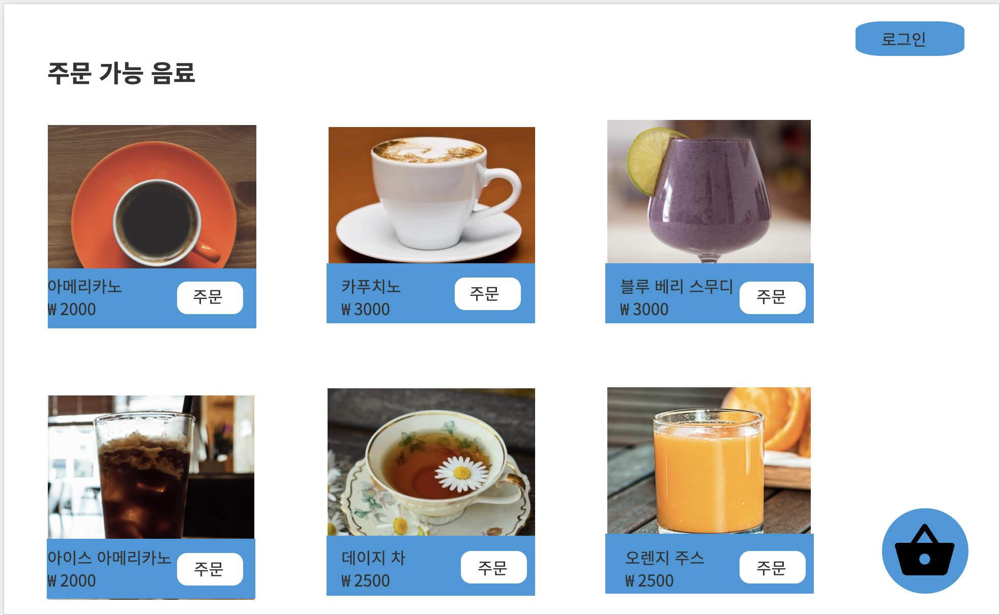
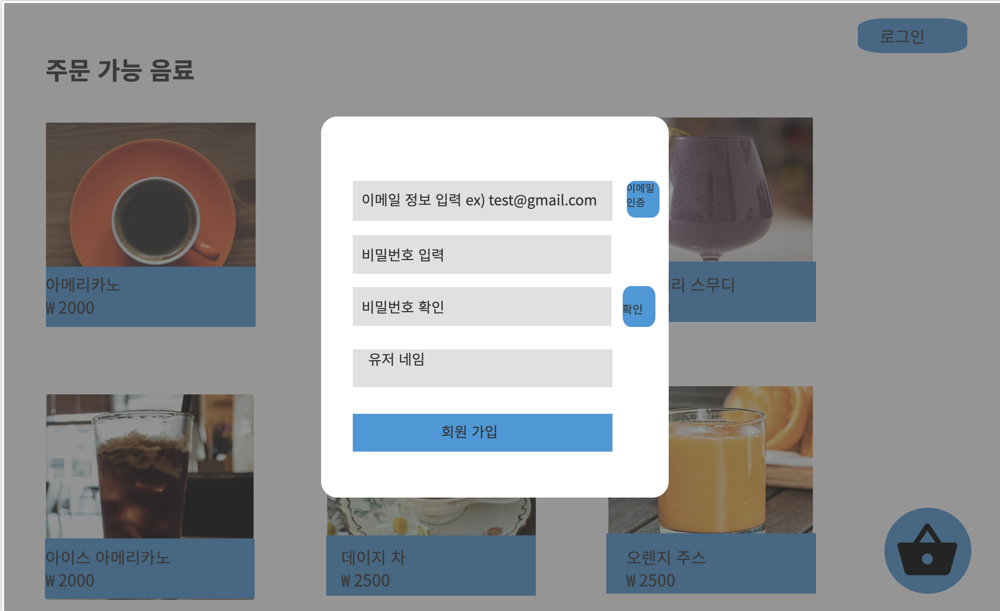
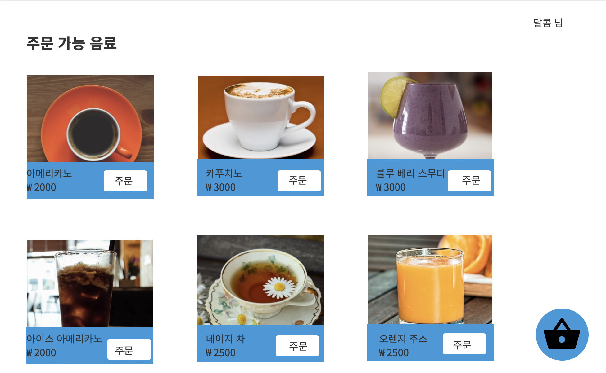
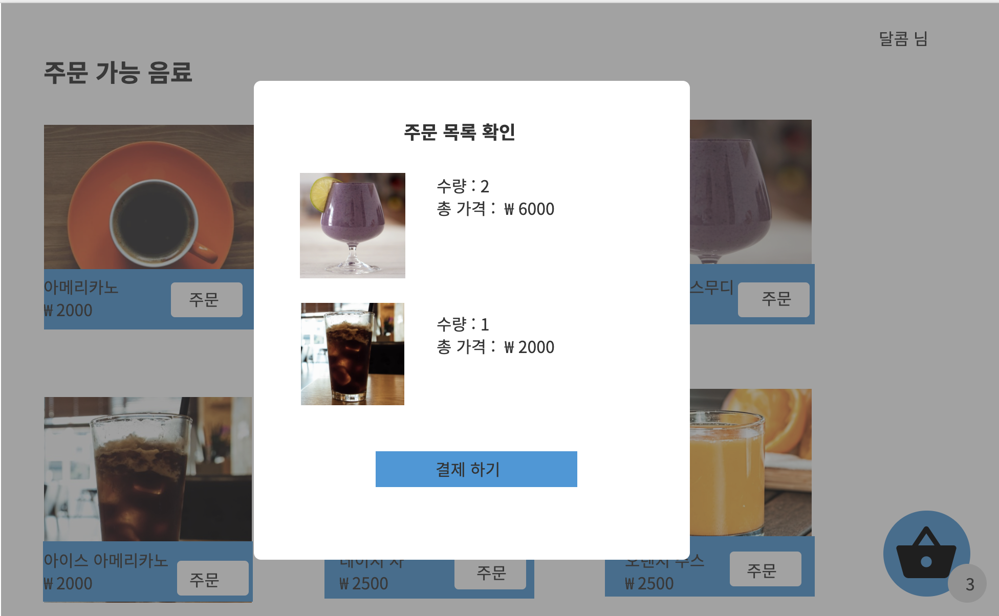

# 요구 사항 정의

## 백엔드 전체 요구 사항

1. 상품 전체 조회
   * 상품명, 상품 가격, 상품 이미지

2. 카카오 간편 로그인 구현
3. 이메일 로그인 구현
4. 비밀번호 찾기 구현 ( 화면 빼먹음)

5. 회원 가입 기능
   * 이메일, 비밀번호 , 유저 네임
6. 사용 가능한 이메일 확인
7. 이메일 인증 구현
8. 이메일로 로그인
   * 이메일, 패스워드 입력 후 버튼

9. 상세 상품 노출
   * 상품 이미지, 상품 명, 상품 가격

10. 상품 주문 기능
    * 상품 id, 상품 개수,  회원 번호, 일시

11. 장바구니 수량 노출 기능

12. 주문 목록 확인
    * 상품 명, 상품 번호, 수량, 가격, 회원 번호

13. 주문 기능
    * 주문 번호 반환
    * 주문 목록 전송

# 화면 요구사항 정의

## 메인 화면

1. 상품 전체 조회
   * 상품명, 상품 가격, 상품 이미지

  

## 로그인 화면

2. 카카오 간편 로그인 구현
3. 이메일 로그인 구현
4. 비밀번호 찾기 구현 ( 화면 빼먹음)

  

## 회원 가입

5. 회원 가입 기능

   * 이메일, 비밀번호 , 유저 네임

     

6. 사용 가능한 이메일 확인

7. 이메일 인증 구현

   

* 비밀번호 확인 기능 (front) 은 프론트

 

 

## 이메일 로그인

8. 이메일로 로그인
   * 이메일, 패스워드 입력 후 버튼

  

## 로그인 - 메인 화면

9. 닉네임 노출 기능

  

## 상품 주문

9. 상세 상품 노출

   * 상품 이미지, 상품 명, 상품 가격

   10. 상품 주문 기능
       * 상품 id, 상품 개수,  회원 번호, 일시

 

 

## 주문- 메인화면

10. 장바구니 수량 노출 기능

 

 

## 주문 목록 확인

12. 주문 목록 확인

* 상품 명, 상품 번호, 수량, 가격, 회원 번호

13. 주문 기능
    * 주문 번호 반환
    * 주문 목록 전송

 

 

## 주문 확인

 

 

